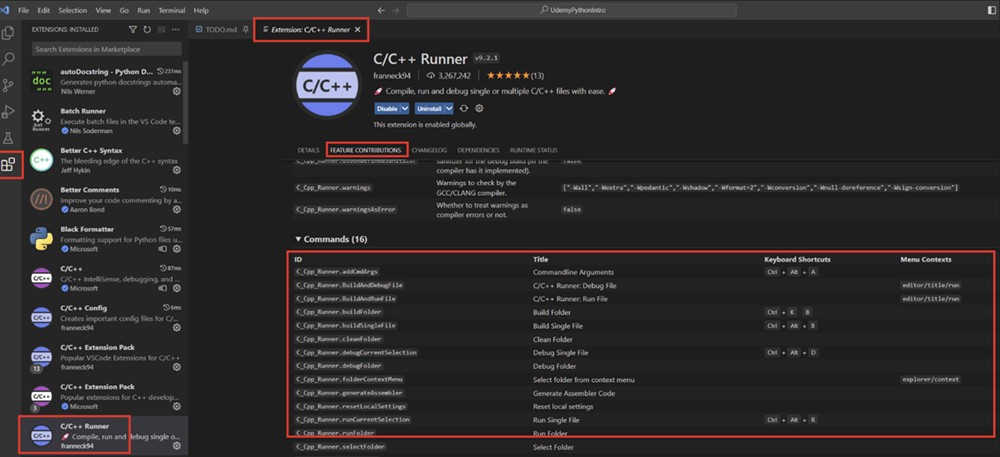

# C/C++ Runner Extension

## Einzelne Dateien Kompilieren (Build) und Ausführen (Run)

### Windows and Linux

- Compile (Build) Single File: Strg+Alt+B
- Execute (Run) Single File: Strg+Alt+R

### MacOS

Für den Compile (Build) Single File und Execute (Run) Single File command könnt ihr die Tastenkombinations hier sehen:



### Windows User mit MSVC Compiler

Euch steht es auch frei den MSVC Compiler (von z.b. VS2022) in meiner C/C++ Runner Erweiterung zu verwenden.  
Dazu müsst ihr in der .vscode/settings.json Datei die folgende Zeile haben:

```json
"C_Cpp_Runner.useMsvc": true,
```
