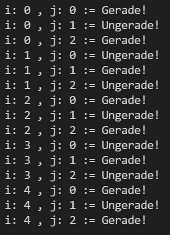

# Exercise

Hallo Leute!

Willkommen bei der nächsten Programmier-Übung in diesem Kurs.

## Aufgaben der Programmierübung

Die Aufgabe ist es die Funktion

```cpp
void mod_cross_sum(int I, int J);
```

zu programmieren die folgenden Outputs in der Konsole ausgibt:

Bei der Funktion ist es die Aufgabe, über eine gegebene Laufweite I und  Laufweite J zu iterieren.
Bei jeder Iteration soll ausgegeben werden, ob die Summe des aktuellen i (for i in I) und j (for j in J) Gerade oder Ungerade ist.
Das heißt, ob das Ergebnis von (i + j) eine gerade oder ungerade Zahl liefert.

Die Funktion soll in der exercise.h Datei deklariert und in der exercise.cc (oder auch exercise.cpp) Datei definiert werden.

## Beispiel


