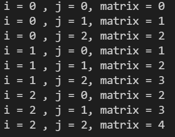
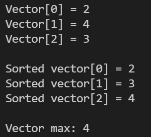

# Exercise

Hallo Leute!

Willkommen bei der nächsten Programmier-Übung in diesem Kurs.

## Aufgaben der Programmierübung

## Aufgabe 1

Initialisiert eine 3x3 Matrix in der Main Funktion, mit dem Wert (i + j) an dem index matrix[i][j].
Verwende dabei den vordefinierten Matrix-Typ aus dem Header.

### Beispiel Aufgabe 1



## Aufgabe 2

Schreibt eine Funktion

```cpp
VectorT max_row_values(MatrixT &matrix);
```

die eine Matrix entgegennimmt und die Zeilenmaxima der Matrix berechnet und diese Maxima in einen neuen Vector abspeichert.Diesen neuen erstellten Vector returned die Funktion dann.

### Beispiel Aufgabe 2


## Aufgabe 3

Schreibt eine Funktion

```cpp
ValueT sort_and_max(VectorT &vec);
```

die einen Double-Vector entgegennimmt und diesen aufsteigend sortiert und zusätzlich das Maximum des Vektors zurückgibt.

### Beispiel Aufgabe 3


