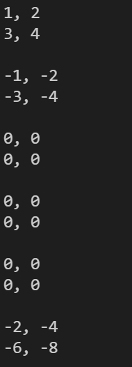

# Exercise

Hallo Leute!

Willkommen bei der nächsten Programmier-Übung in diesem Kurs.

## Vorwort

In dieser Programmierübung erweitern wir unsere Matrix Klasse.  
Mathematische Erklärung: 

- Matrix mit Matrix multiplizieren: https://www.youtube.com/watch?v=9kB48logJDI
- Matrix mit Skalaren Wert: https://www.youtube.com/watch?v=AOKHouTlQa8

## Aufgaben der Programmierübung

### Aufgabe 1

Schreibe eine Funktion, die eine Matrix mit einem Skalaren Wert multipliziert.

```cpp
Matrix operator*(const double &scalar)
Matrix& operator*=(const double &scalar);
```

### Aufgabe 2

Schreibe eine Funktion, die eine Matrix mit einem Skalaren Wert dividiert.

```cpp
Matrix operator/(const double &scalar);
Matrix& operator/=(const double &scalar);
```

### Aufgabe 3

Schreibe eine Funktion. die zwei Matritzen mit einander multipliziert.

```cpp
Matrix operator*(const Matrix &rhs);
Matrix& operator*=(const Matrix &rhs);
```

### Beispiel

```cpp
int main()
{
    Matrix m1(1.0, 2.0, 3.0, 4.0);
    m1.print_matrix();

    Matrix m2(-1.0, -2.0, -3.0, -4.0);
    m2.print_matrix();

    Matrix m3 = m1 + m2;
    m3.print_matrix();

    Matrix m4 = m1 - m1;
    m4.print_matrix();

    m1 -= m1;
    m1.print_matrix();

    m2 += m2;
    m2.print_matrix();

    return 0;
}
```

Resultiert in folgender Ausgabe:


