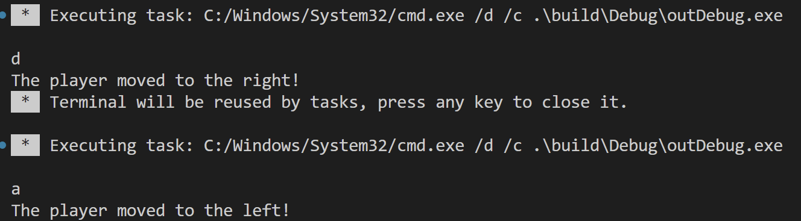

# Computer Game 1

## Disclaimer

Ich werde meine Lösung Schritt-für-Schritt live programmieren.  
Deswegen müsst ihr diese nicht selber lösen, ihr könnt es aber gerne probieren.

## Vorwort

Wir werden in den ComputerGame Abschnitten ein kleines Spiel programmieren, wo sich der Spieler auf, zuerst einem 1D Spielbrett, nach links und rechts bewegen kann.  
Später wird dies auch ein 2D-Spielbrett sein mit zusätzlichen Hindernissen. 
Da wir aktuell noch nicht so weit sind, werden wir uns jetzt erstmal um die Links/Rechts Steuerung kümmern.  

## Exercise 1

Implementiere den folgenden Code:

Der User kann per Terminal eingeben ob man sich nach links ('a') oder nacht rechts ('d') bewegen will.

So würde der Terminal Output dazu aussehen:

