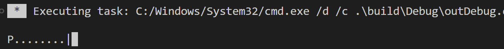
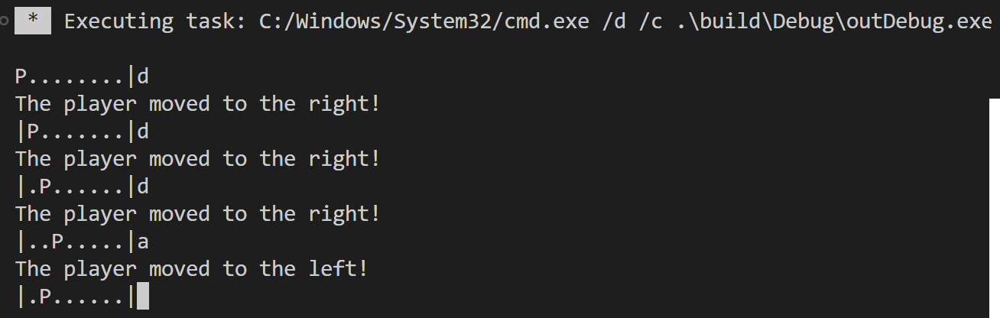

# Computer Game 2

## Disclaimer

Ich werde meine Lösung Schritt-für-Schritt live programmieren.  
Deswegen müsst ihr diese nicht selber lösen, ihr könnt es aber gerne probieren.

## Exercise 1

Implementiere den folgenden Code:

Der User kann jetzt nicht nur einmalig nach links oder rechts gehen, sondern solange sich im "Spielfeld" bewegen, bis er im Ziel angekommen ist.

So würde der Terminal Output beim Start aussehen:

Und so nachdem der Spieler sich mehrmals bewegt hat:

- 'P' ist der Spieler
- '|' ist der Startpunkt (links) und das Ziel (rechts)
- '.' sind die restlichen Spielfelder

Der Spieler hat das Spiel gewonnen, wenn er das ganz rechte Feld betritt.  
