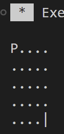

# Computer Game 5

## Disclaimer

Ich werde meine Lösung Schritt-für-Schritt live programmieren.  
Deswegen müsst ihr diese nicht selber lösen, ihr könnt es aber gerne probieren.

## Exercise 1

Wir werden jetzt ein 2D-Spielfeld verwenden.  
Für den Spieler, dem Start-Punkt und dem Ziel speichern wir diese Position mit der folgenden Struktur ab:

```cpp
struct Coordinate
{
    std::uint32_t x;
    std::uint32_t y;
};
```

Die Funktionen müssen dementsprechend angepasst werden.
Das Spielfeld würde dann so aussehen:



Das heißt, das Spielfeld ist 5x5 groß.  
Der Spieler startet oben links. Das Ziel ist unten rechts.  
Bei der execute_move Funktion muss dann geschaut werden, dass der Spieler nicht aus dem Spielfeld rausläuft.  
Also sowohl vertikal aus auch horizontal!
