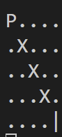

# Computer Game 6

## Disclaimer

Ich werde meine Lösung Schritt-für-Schritt live programmieren.  
Deswegen müsst ihr diese nicht selber lösen, ihr könnt es aber gerne probieren.

## Exercise 1

Auf unserem 2D-Spielfeld wollen wir jetzt noch Hindernisse einbauen.  
Wenn der Spieler auf so ein Hindernis tritt, dann hat er das Spiel verloren.  
Das heißt ja auch, dass die while Schleife vorzeitig beendet werden kann.



Die Hindernisse sind das "X" auf dem Spielfeld.

Diese werden wir jetzt erstmal konstant auf den folgenden Positionen setzen:

```cpp
const auto obstacles = std::vector<Coordinate>{
    Coordinate{.x = 1, .y = 1},
    Coordinate{.x = 2, .y = 2},
    Coordinate{.x = 3, .y = 3},
};
```

Anmerkung: Da die Anzahl an Hindernisse constant ist könnte man auch ein Array anstatt einem Vector verwenden.
